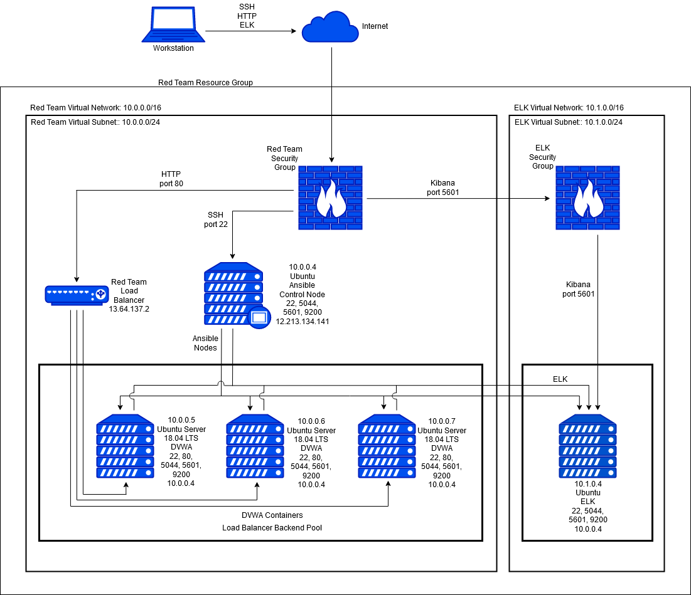
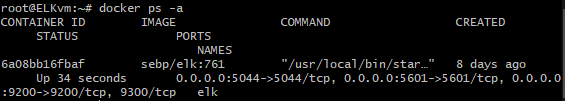
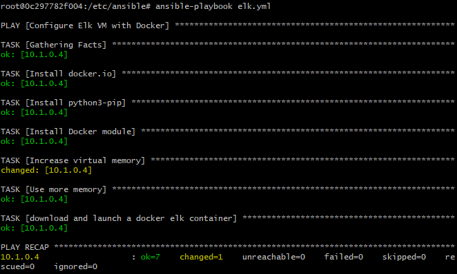
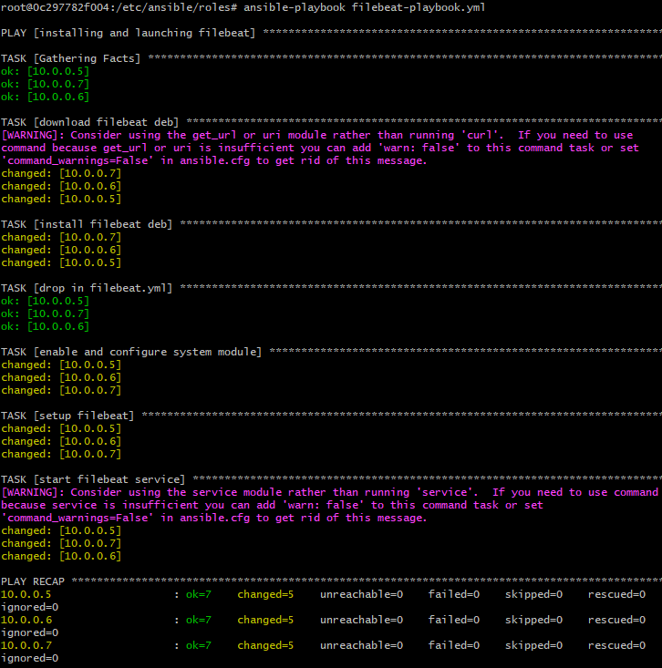
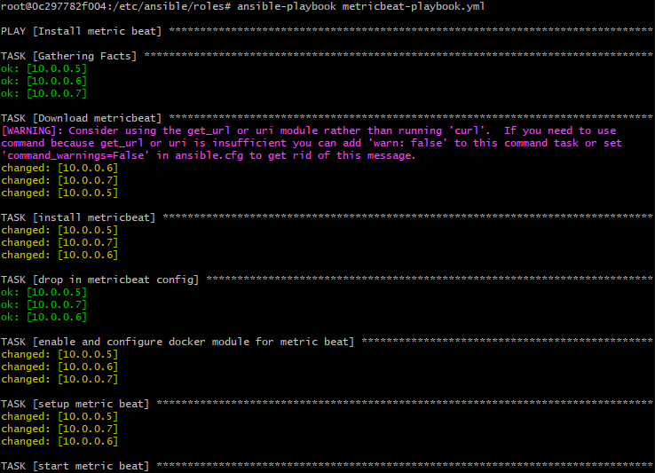
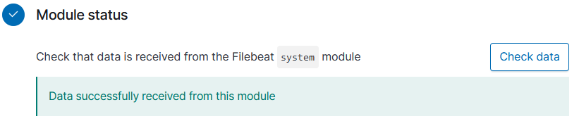
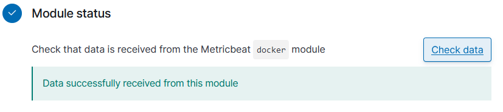

## Automated ELK Stack Deployment

The files in this repository were used to configure the network depicted below.



These files have been tested and used to generate a live ELK deployment on Azure. They can be used to either recreate the entire deployment pictured above. Alternatively, select portions of the playbook file may be used to install only certain pieces of it, such as Filebeat.


```yml
#elk.yml
---
- name: Configure Elk VM with Docker
  hosts: elkservers
  remote_user: sysadmin
  become: true
  tasks:
    # Use apt module
    - name: Install docker.io
      apt:
        update_cache: yes
        force_apt_get: yes
        name: docker.io
        state: present

      # Use apt module
    - name: Install python3-pip
      apt:
        force_apt_get: yes
        name: python3-pip
        state: present

      # Use pip module (It will default to pip3)
    - name: Install Docker module
      pip:
        name: docker
        state: present

      # Use command module
    - name: Increase virtual memory
      command: sysctl -w vm.max_map_count=262144

      # Use sysctl module
    - name: Use more memory
      sysctl:
        name: vm.max_map_count
        value: '262144'
        state: present
        reload: yes

      # Use docker_container module
    - name: download and launch a docker elk container
      docker_container:
        name: elk
        image: sebp/elk:761
        state: started
        restart_policy: always
        # Please list the ports that ELK runs on
        published_ports:
          -  5601:5601
          -  9200:9200
          -  5044:5044
```

```yml
#filebeat-playbook.yml
---
- name: installing and launching filebeat
  hosts: webservers
  become: yes
  tasks:

  - name: download filebeat deb
    command: curl -L -O https://artifacts.elastic.co/downloads/beats/filebeat/filebeat-7.4.0-amd64.deb

  - name: install filebeat deb
    command: dpkg -i filebeat-7.4.0-amd64.deb

  - name: drop in filebeat.yml
    copy:
      src: /etc/ansible/files/filebeat-config.yml
      dest: /etc/filebeat/filebeat.yml

  - name: enable and configure system module
    command: filebeat modules enable system

  - name: setup filebeat
    command: filebeat setup

  - name: start filebeat service
    command: service filebeat start
```

```yml
#metricbeat-playbook.yml
---
- name: Install metric beat
  hosts: webservers
  become: true
  tasks:
    # Use command module
  - name: Download metricbeat
    command: curl -L -O https://artifacts.elastic.co/downloads/beats/metricbeat/metricbeat-7.6.1-amd64.deb

    # Use command module
  - name: install metricbeat
    command: dpkg -i metricbeat-7.6.1-amd64.deb

    # Use copy module
  - name: drop in metricbeat config
    copy:
      src: /etc/ansible/files/metricbeat-config.yml
      dest: /etc/metricbeat/metricbeat.yml

    # Use command module
  - name: enable and configure docker module for metric beat
    command: metricbeat modules enable docker

    # Use command module
  - name: setup metric beat
    command: metricbeat setup

    # Use command module
  - name: start metric beat
    command: metricbeat -e
```

This document contains the following details:
- Description of the Topology
- Access Policies
- ELK Configuration
  - Beats in Use
  - Machines Being Monitored
- How to Use the Ansible Build


### Description of the Topology

The main purpose of this network is to expose a load-balanced and monitored instance of DVWA, the D*mn Vulnerable Web Application.

Load balancing ensures that the application will be highly available, in addition to restricting access to the network.
- Load balancers protects the availability aspect of the network security. The multiple nodes serving redundant data reduces downtime and increases availability.
- An advantage of a jump box is that it reduces access to the network by isolating entry to a single server.


Integrating an ELK server allows users to easily monitor the vulnerable VMs for changes to the logs and system performance.
- Filebeat watches for changes in the logs then collects and aggregates them.
- Metricbeat records system metrics from services running on the server.

The configuration details of each machine may be found below.
_Note: Use the [Markdown Table Generator](http://www.tablesgenerator.com/markdown_tables) to add/remove values from the table_.

| Name     | Function | IP Address | Operating System |
|----------|----------|------------|------------------|
| Jump Box | Gateway  | 10.0.0.4   | Linux            |
| Web-1    | DVWA     | 10.0.0.5   | Linux            |
| Web-2    | DVWA     | 10.0.0.6   | Linux            |
| Web-3    | DVWA     | 10.0.0.7   | Linux            |
| ELK-VM   | ELK      | 10.1.0.4   | Linux            |


### Access Policies

The machines on the internal network are not exposed to the public Internet.

Only the Jump box machine can accept connections from the Internet. Access to this machine is only allowed from the following IP addresses:
	12.213.134.141

Machines within the network can only be accessed by Jump box.

A summary of the access policies in place can be found in the table below.

| Name     | Publicly Accessible | Allowed IP Addresses   |
|----------|---------------------|------------------------|
| Jump Box | Yes                 | 12.213.134.141	  |
| ELK VM   | No                  | 10.0.0.4               |
| Web-1    | No                  | 10.0.0.4	          |
| Web-2    | No                  | 10.0.0.4	          |
| Web-3    | No                  | 10.0.0.4	          |


### Elk Configuration

Ansible was used to automate configuration of the ELK machine. No configuration was performed manually, which is advantageous because we can configure multiple machines at once in the entire network by just running a playbook.

The playbook implements the following tasks:
- The first part specifies the hosts where the playbook is going to install the ELK stack. It also defines the remote user that is installing the playbook.
- Then, it installs docker for containerization.
- Next, it installs pip for python to install the necessary modules for docker.
- It will then setup the appropriate virtual memory needed to run smoothly.
- Lastly, the elk container will be downloaded, configured, and open necessary ports.

The following screenshot displays the result of running `docker ps` after successfully configuring the ELK instance.




### Target Machines & Beats
This ELK server is configured to monitor the following machines:
- 10.0.0.4
- 10.0.0.5
- 10.0.0.6
- 10.0.0.7

We have installed the following Beats on these machines:
- Filebeat
- Metricbeat

These Beats allow us to collect the following information from each machine:
- Filebeats accesses the log files of the servers. It gathers the system logs, authentication logs for server accesses, and package manager logs for application installations.
- Metricbeats access server metrics and services in order to monitor system performance. These are the CPU usage, disk IO, and network IO statistics.


### Using the Playbook
In order to use the playbook, you will need to have an Ansible control node already configured. Assuming you have such a control node provisioned: 

SSH into the control node and follow the steps below:
- Copy the filebeat-config.yml and metricbeat-config.yml file to /etc/ansible/files folder.
- Update the hosts file to include the ip address of the target machines.
- Run the playbook, and navigate to the target machines to check that the installation worked as expected.

_Which file is the playbook? Where do you copy it?_
- The playbook file are files with the extension yml and should be copied to `/etc/ansible`.

_Which file do you update to make Ansible run the playbook on a specific machine? How do I specify which machine to install the ELK server on versus which to install Filebeat on?_
- We need to specify in the hosts file the list all the machine in the network. IP addresses are delimited by a header that tells ansible which hosts should the playbook be run into.

_Which URL do you navigate to in order to check that the ELK server is running?_
- http://your-ip:5601/app/kibana#/home?_g=()


### Installation
Assuming that you have the network to run an ELK server, we can then download the necessary files. Determine which machine will be the Ansible control node to deploy the playbooks from as this is where we will download the necessary files. Let's begin by installing Docker in order to containerize the Ansible control node. We can install docker by running:

```
$ apt install docker.io
```

We will then pull the ansible container image with: 

```
$ docker pull cyberxsecurity/ansible
```

Then initialize the image:

```
$ docker run -it cyberxsecurity/ansible bash
```

Remember that we have to only run this command once as it spawns a container instance everytime we execute this command. We don't want to end up with duplicate container instances in the machine. Next time we just need to run `docker start [container name]`.

Now that we are inside of the ansible container we are going to clone the repo:

```
$ git clone https://github.com/26c4u/ELK_stack
```

Move the contents of the repo to `/etc/ansible`.

Update the ansible.cfg file with the administrator's user name at line #107.

Determine the IP addresses of the machines and update the hosts.yml. This is done by categorizing certain machines using headers and listing the ip addresses next to it.

```yml
[webservers]
10.0.0.5 ansible_python_interpreter=/usr/bin/python3
10.0.0.6 ansible_python_interpreter=/usr/bin/python3
10.0.0.7 ansible_python_interpreter=/usr/bin/python3

[elkservers]
10.1.0.4 ansible_python_interpreter=/usr/bin/python3
```

Run the elk.yml file to the install ELK stack on the target machines by running:

```
$ ansible-playbook elk.yml
```

It is important to verify the result of running the playbook to ensure that the ELK stack is installed properly. Below is a screenshot for reference of a successful ELK installation in a machine.



Check if a step has failed, then fix the playbook if needed.

Afterwards, run the Filebeat playbook in the roles folder to install filebeat:

```
$ ansible-playbook filebeat-playbook.yml
```



Next run the Metricbeat playbook:

```
$ ansible-playbook metricbeat-playbook.yml
```



Then verify in Kibana if Filebeat and Metricbeat are running by visiting `http://your-ip:5601/app/kibana#/home?_g=()` in your web browser. 

For Filebeat, go to 'Add log data &#8594; System logs &#8594; DEB tab'. Click on Check data wher it should return a success if installation went well.



For Metricbeat, go to 'Add metric data &#8594; Docker metrics &#8594; DEB tab'.



If the widgets are populated with data and graphs then congratulations!, you have successfully added ELK in your network.
